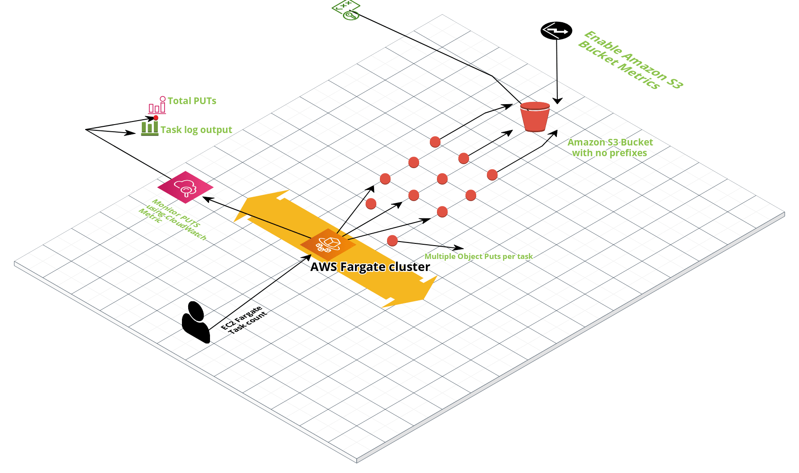

# AWS S3 Bucket Load Testing

Purpose: Create and Put files into a single S3 bucket as fast as possible. 

## Summary

The goal is to create as many files as specified, then copy them into Amazon S3 using a python script running in a Fargate Task. 

Steps: 

These steps are guidance and can be executed out of order by an experienced operator:

* Create a container using the included script
* Create an Amazon S3 bucket
	* Put a lifecycle policy to delete objects on bucket
* Create a Fargate Application and Task using your Image
* Put the bucket name of the newly created bucket in a DNS TXT entry
* Deploy the Fargate application and monitor X-Ray, CloudWatch metrics, and CloudWatch logs

 

### Commands to Build container zip file: 
###### (to be uploaed to S3 for container build pipeline):

rm putcontainer.zip
zip -r putcontainer.zip ./putcontainer 
rm getcontainer.zip
zip -r getcontainer.zip ./getcontainer 

aws s3 cp putcontainer.zip s3://amazon-s3-bucket-load-test-containerbucket-15d8doiyy402t/putcontainer.zip

aws s3 cp getcontainer.zip s3://amazon-s3-bucket-load-test-containerbucket-15d8doiyy402t/getcontainer.zip

### CLI Commands to Deploy Solution: 

sam validate
sam build 
sam deploy --guided

### References:

https://stackoverflow.com/questions/10607688/how-to-create-a-file-name-with-the-current-date-time-in-python

https://stackoverflow.com/questions/14275975/creating-random-binary-files

http://ls.pwd.io/2013/06/parallel-s3-uploads-using-boto-and-threads-in-python/

https://docs.aws.amazon.com/AmazonS3/latest/user-guide/empty-bucket.html

https://docs.aws.amazon.com/AmazonS3/latest/user-guide/configure-metrics.html

